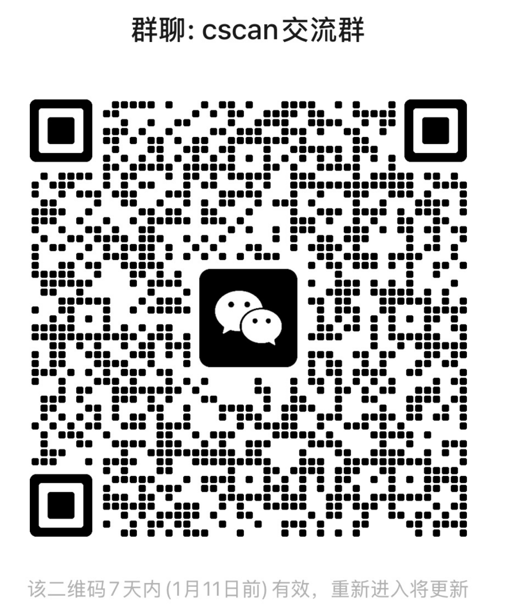

# CSCAN

**分布式网络资产扫描平台** | Go-Zero + Vue3

[](https://golang.org)
[](https://vuejs.org)
[](LICENSE)

---

## 目录
<details>
<summary>⭐ 介绍 </summary>

- **资产发现** - 端口扫描 (Naabu/Masscan)，端口服务识别（Nmap）
- **指纹识别** - Httpx + Wappalyzer + 自定义指纹引擎，3W+自定义指纹
- **漏洞检测** - Nuclei SDK引擎，800+自定义POC
- **Web 截图** - Chromedp / HTTPX 引擎
- **在线数据源** - FOFA / Hunter / Quake API 聚合搜索与导入
- **报告管理** - 任务报告生成，支持 Excel 导出
- **分布式架构** - Worker 节点水平扩展，支持多节点并行扫描
- **多工作空间** - 项目隔离，团队协作
</details>

<details open>
<summary>⭐ 快速开始 </summary>

```bash
git clone https://github.com/tangxiaofeng7/cscan.git
cd cscan
docker-compose up -d

#适配arm架构
docker-compose -f docker-compose-arm64.yaml up -d
```

访问 `http://localhost:3000`，默认账号 `admin / 123456`
</details>

<details>
<summary>⭐ 截图 </summary>

#### 工作台


#### 任务管理


#### 资产管理


#### 扫描日志


#### 查看报告


#### POC管理


#### 指纹管理

</details>

<details>
<summary>⭐ 架构 </summary>

```
Vue3 Web ──▶ API Server ──▶ MongoDB
                │
                ▼
              Redis
                │
                ▼
            RPC Server
                │
    ┌───────────┼───────────┐
    ▼           ▼           ▼
 Worker 1   Worker 2   Worker N
```

| 组件 | 技术栈 |
|------|--------|
| 后端框架 | Go-Zero, gRPC, JWT |
| 数据存储 | MongoDB, Redis |
| 前端框架 | Vue 3, Element Plus, Vite |
| 端口扫描 | Nmap, Masscan, Naabu |
| 指纹识别 | Httpx, Wappalyzer, 自定义引擎 |
| 漏洞扫描 | Nuclei |
| 截图引擎 | Httpx, Chromedp (Chromium) |
</details>

<details>
<summary>⭐ 参考 </summary>

- [go-zero](https://github.com/zeromicro/go-zero) - 微服务框架
- [Nuclei](https://github.com/projectdiscovery/nuclei) - 漏洞扫描引擎
- [Httpx](https://github.com/projectdiscovery/httpx) - HTTP 探测工具
- [Naabu](https://github.com/projectdiscovery/naabu) - 端口扫描器
- [Wappalyzer](https://github.com/projectdiscovery/wappalyzergo) - 指纹识别
- [nemo_go](https://github.com/hanc00l/nemo_go) - 参考项目
</details>

## License

MIT

## 加入交流群
